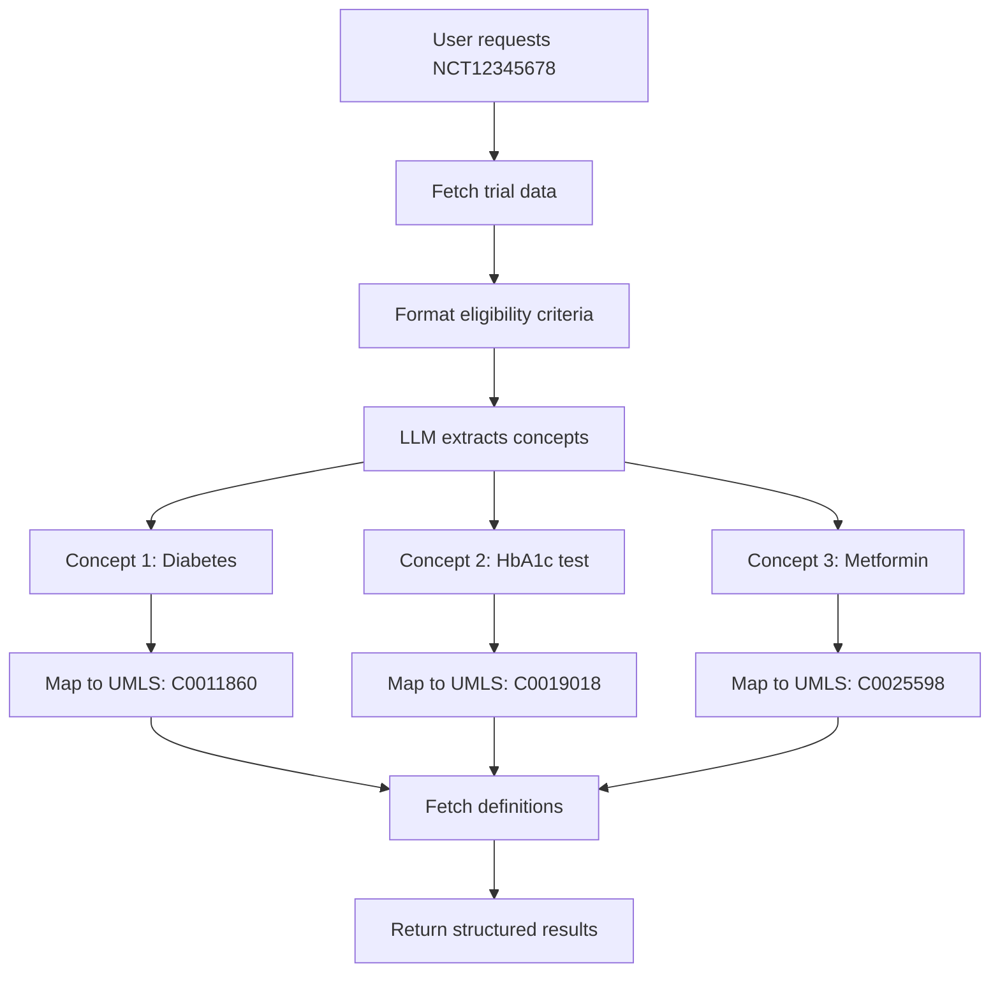

# Clinical Trial Concept Extraction Tool

## Overview

The `extract_clinical_trial_concepts` tool uses AI-powered concept extraction combined with UMLS (Unified Medical Language System) mapping to automatically identify and standardize medical concepts from clinical trial eligibility criteria.

## How It Works

### Architecture

```
1. Clinical Trial Retrieval
   └─> Fetches trial data via ClinicalTrials.gov API
   
2. LLM-Based Concept Extraction (via MCP Sampling)
   └─> Analyzes eligibility criteria text
   └─> Identifies medical concepts in categories:
       • Conditions/Diseases
       • Procedures/Tests
       • Medications
       • Biomarkers
       • Demographics
       • Temporal constraints
   
3. UMLS Mapping
   └─> Maps each extracted concept to standardized vocabularies
   └─> Retrieves CUIs (Concept Unique Identifiers)
   └─> Fetches definitions from multiple sources
   
4. Structured Results
   └─> Returns organized data with mappings and definitions
```

## Usage

### MCP Client (Stdio)

The tool is available through the MCP protocol with sampling capability:

```json
{
  "name": "extract_clinical_trial_concepts",
  "arguments": {
    "nct_id": "NCT12345678"
  }
}
```

### Example Response

```json
{
  "success": true,
  "data": {
    "nct_id": "NCT12345678",
    "trial_title": "Study of Drug X in Type 2 Diabetes",
    "study_conditions": ["Type 2 Diabetes Mellitus"],
    "extraction_summary": {
      "total_concepts": 25,
      "by_category": {
        "Conditions/Diseases": 8,
        "Procedures/Tests": 6,
        "Medications": 4,
        "Biomarkers": 5,
        "Demographics": 2
      },
      "mapped_to_umls": 23
    },
    "extracted_concepts": [
      {
        "original_concept": "Type 2 Diabetes Mellitus",
        "category": "Conditions/Diseases",
        "context": "inclusion",
        "specifics": "HbA1c > 7.0%",
        "umls_mapping": {
          "found": true,
          "cui": "C0011860",
          "preferred_term": "Diabetes Mellitus, Non-Insulin-Dependent",
          "semantic_types": ["Disease or Syndrome"],
          "score": 0.98,
          "definitions": [
            {
              "source": "NCI",
              "text": "A type of diabetes mellitus that is characterized by..."
            },
            {
              "source": "SNOMEDCT_US",
              "text": "Diabetes mellitus without complication..."
            }
          ]
        }
      },
      {
        "original_concept": "HbA1c measurement",
        "category": "Procedures/Tests",
        "context": "inclusion",
        "specifics": "baseline value required",
        "umls_mapping": {
          "found": true,
          "cui": "C0019018",
          "preferred_term": "Hemoglobin A, Glycosylated",
          "semantic_types": ["Laboratory Procedure", "Amino Acid, Peptide, or Protein"],
          "definitions": [...]
        }
      }
    ],
    "eligibility_criteria": {
      "inclusion": [
        "Diagnosed with Type 2 Diabetes Mellitus",
        "HbA1c > 7.0% at screening",
        "Age 18-75 years"
      ],
      "exclusion": [
        "Type 1 Diabetes",
        "Severe renal impairment",
        "Current use of insulin"
      ]
    }
  }
}
```

## Key Features

### 1. Comprehensive Concept Categories

- **Conditions/Diseases**: Diagnoses, symptoms, disorders, comorbidities
- **Procedures/Tests**: Lab tests, imaging, diagnostic procedures, surgeries  
- **Medications**: Drugs, therapies, treatments, drug classes
- **Biomarkers**: Lab values, genetic markers, physiological measurements
- **Demographics**: Age, gender, pregnancy status, population characteristics
- **Temporal**: Time periods, durations, timing constraints

### 2. Context-Aware Extraction

Each concept includes:
- **Original concept**: Exact text as extracted
- **Category**: Classification into medical domain
- **Context**: Whether from inclusion or exclusion criteria
- **Specifics**: Quantitative values, ranges, qualifiers

### 3. UMLS Integration

Automatic mapping provides:
- **CUI**: Standard concept identifier across vocabularies
- **Preferred Term**: Standardized name
- **Semantic Types**: Medical classification (disease, procedure, etc.)
- **Definitions**: From multiple authoritative sources (NCI, SNOMED CT, etc.)
- **Match Score**: Confidence level of the mapping

### 4. Smart Caching

- Results cached for 24 hours per NCT ID
- Reduces API calls and improves response time
- Ensures consistent results during analysis sessions

## Use Cases

### 1. Trial Eligibility Analysis

Understand what medical concepts define trial participation:
```
→ Extract concepts from NCT12345678
→ Review conditions required for inclusion
→ Identify exclusion criteria concepts
→ Map to standardized vocabularies for comparison
```

### 2. Multi-Trial Comparison

Compare eligibility criteria across similar trials:
```
→ Extract concepts from Trial A, B, C
→ Compare common conditions
→ Identify differences in biomarker thresholds
→ Analyze demographic requirements
```

### 3. Patient-Trial Matching

Determine trial eligibility for specific patients:
```
→ Extract required conditions from trial
→ Map patient diagnoses to UMLS CUIs
→ Compare patient CUIs with trial concept CUIs
→ Identify matching criteria
```

### 4. Literature Research

Connect trial criteria to research literature:
```
→ Extract medication concepts from trials
→ Use UMLS CUIs to search PubMed
→ Find research on drug interactions
→ Analyze evidence base for eligibility criteria
```

### 5. Clinical Decision Support

Support clinicians in trial enrollment:
```
→ Extract test/procedure requirements
→ Map to standard medical codes
→ Generate checklist for patient evaluation
→ Identify required assessments
```

## Technical Implementation

### MCP Sampling Integration

The tool leverages MCP's sampling capability to use the client's LLM:

```javascript
// Server requests sampling from client's LLM
const samplingCallback = async (samplingParams) => {
  const response = await server.requestSampling(samplingParams, request.meta);
  return { content: response.content };
};

// Tool coordinates extraction workflow
const result = await conceptExtractorTool.extractConcepts(
  nctId, 
  samplingCallback
);
```

**Benefits of this approach:**
- No API keys needed in the server
- Uses client's preferred LLM (Claude, GPT-4, etc.)
- Server remains stateless
- Privacy-preserving architecture

### LLM Prompt Design

The system uses a structured prompt optimized for medical concept extraction:

```
System: You are a medical terminology expert...

User: Analyze the following clinical trial eligibility criteria...

[Formatted criteria with demographics, inclusion, exclusion]

Extract concepts into categories:
1. Conditions/Diseases
2. Procedures/Tests
3. Medications
4. Biomarkers
5. Demographics
6. Temporal

Return JSON with: {concept, category, context, specifics}
```

**Prompt characteristics:**
- Low temperature (0.1) for consistent extraction
- Structured JSON output format
- Category-based organization
- Context preservation

### UMLS Mapping Pipeline

After LLM extraction, each concept is mapped through:

1. **Search**: Query UMLS for exact matches
2. **Selection**: Choose best match (highest score)
3. **Enrichment**: Fetch definitions for the CUI
4. **Compilation**: Combine into structured result

## Limitations

### HTTP API Not Supported

This tool requires MCP protocol with sampling capability. It is **not available** via the HTTP/REST API because:
- HTTP endpoint cannot access client's LLM
- Sampling requires bidirectional MCP communication
- Server does not have its own LLM API keys

**Workaround for HTTP clients:**
1. Use the MCP client for concept extraction
2. Cache results for downstream HTTP API usage
3. Or integrate your own LLM directly in HTTP client

### Concept Mapping Accuracy

- Not all concepts may have UMLS mappings
- Medical slang or abbreviations may not match
- Context-specific meanings may be ambiguous
- Some concepts may have multiple valid CUIs

**Recommendations:**
- Review mappings for accuracy
- Verify CUIs against source vocabularies
- Consider semantic types for disambiguation
- Use definitions to confirm correct mapping

## Environment Requirements

### Required

- **UMLS API Key**: Set `UMLS_API_KEY` environment variable
- **MCP Client**: Must support sampling capability
- **Node.js**: Version 18 or higher

### Optional

- **Cache TTL**: Configure cache duration (default: 86400 seconds)

## Error Handling

The tool provides detailed error messages:

```json
{
  "success": false,
  "error": "Invalid NCT ID format. Expected format: NCT########"
}
```

Common errors:
- Invalid NCT ID format
- Trial not found
- UMLS API authentication failure
- LLM sampling failure
- Concept mapping errors

## Performance

### Typical Execution Time

- Trial retrieval: 1-2 seconds (cached after first request)
- LLM concept extraction: 5-15 seconds (depends on criteria length)
- UMLS mapping: 2-10 seconds (depends on concept count)
- **Total**: ~10-30 seconds for full extraction

### Optimization

- Results cached for 24 hours
- Parallel UMLS lookups for concepts
- Limited definitions per concept (max 5)
- Configurable max results

## Future Enhancements

Potential improvements:
1. Batch processing for multiple trials
2. Relationship extraction between concepts
3. Temporal relationship parsing (before/after)
4. Quantitative value extraction and normalization
5. Integration with additional medical ontologies (RxNorm, LOINC)
6. Confidence scoring for extractions
7. Validation against trial protocol documents

## Example Workflow



## Related Tools

Use in combination with:
- `get_clinical_trial_by_nct_id`: Get full trial details
- `search_clinical_concepts`: Manual UMLS concept search
- `get_concept_definitions_by_cui`: Deep dive into specific CUIs
- `get_related_clinical_concept_by_cui`: Explore concept relationships
- `pubmed_search`: Find literature for extracted concepts

## Support

For issues or questions:
1. Check UMLS API key is valid
2. Verify MCP client supports sampling
3. Review NCT ID format (NCT + 8 digits)
4. Check server logs for detailed error messages
5. Test with a known trial (e.g., NCT04793126)
